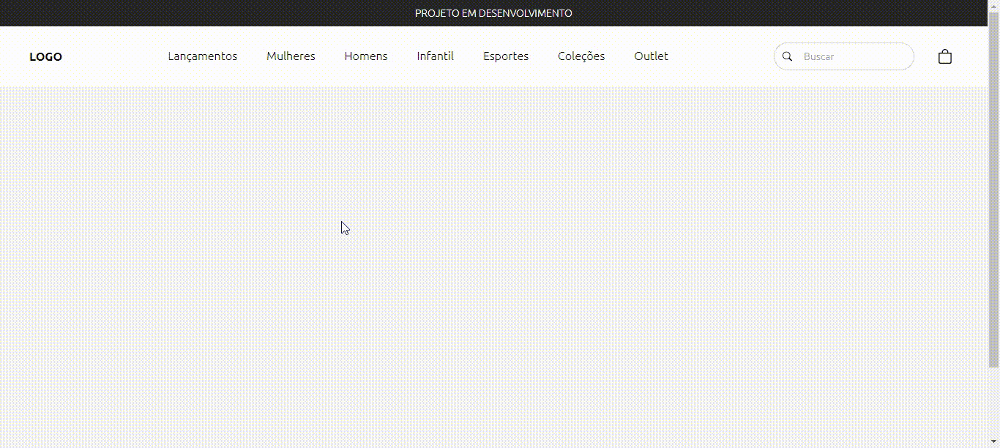

# Demonstração do projeto





# Tecnologias utilizadas
- TypeScript: 4.9.5
- TailwindCss: 3.2.6

# Configurações do Ambiente

## Instalação
- Instalar package.json: `npm init`
- Instalar TS localmente: `npm i typescript -D`
  - Criar arquivo tsconfig.json:
    ```
    {
      "compilerOptions": {
        "target": "esnext",
        "rootDir": "./assets/ts",                                  
        "outDir": "./assets/dist/js",                                        
        "noImplicitAny": false,
        "removeComments": true,
        "preserveConstEnums": true,
        "sourceMap": true,  
      }
    }
    ```
- Configurar servidor embutido PHP: https://github.com/rauldiamantino/ambiente-php

## Compilação e localhost
- Compilar TS: `npx tsc`
- Localhost PHP: `php -S localhost:8000`
